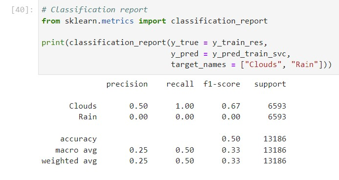

# Analisa Cuaca Kota Denpaasar Menggunakan Algoritma Machine Learning

Hari ini ketika kita melihat ke langit warna biru mendominasi keadaan di ata kita, namun tidak selamanya cerahnya hari akan selalu kita rasakan, bisa saja besok menjadi gelap. Begitu pula dengan suhu bisa saja hari ini suhu udara sangat panas namun besok menjadi dingin. Perubahan perubahan itu yang kita sebut dengan Cuaca. Cuaca di berbagai tempat belahan dunia manapun dapat berubah sewaktu-waktu dalam hitungan hari, jam, bahkan menit. 

Cuaca dan perubahannya dapat dikendalikan oleh beberapa faktor alam yang mengiringinya seperti :
1. Suhu/Temperatur (temp): 
Suhu atau temperatur adalah besaran untuk menyatakan derajat panas atau dingin. Manusia bisa merasakan kondisi panas atau dingin melalui organ tubuh atau indera yang dimilikinya, namun tidak bisa menentukan besarannya secara langsung. Cuaca ini akan diukur dengan satuan derajat celcius.

2. Tekanan udara (Pressure): 
Tekanan udara disebut juga air pressure, merupakan komponen penting yang memengaruhi cuaca dan iklim di suatu wilayah. Air pressure berperan dalam menggerakkan udara dari satu wilayah ke wilayah lain, membawa awan, juga mendorong terciptanya hujan. Tekanan udara diukur dengan alat bernama barometer. Alat ini bekerja secara otomatis, dan penggunanya bisa langsung melihat skala yang muncul. satuan yang digunakan adalah hecto pascal hPa.

3. Kelembapan (Humidity) :
Kelembapan udara adalah kandungan uap air yang ada di dalam udara. Jumlah uap air yang ada dalam udara ini sebenarnya hanya sebagian kecil dari seluruh atmosfer. Kira-kira sekitar 2 persen dari jumlah massa. Akan tetapi, uap air tersebut merupakan salah satu komponen udara yang sangat penting, ditinjau dari segi cuaca dan iklim. satuan yang digunakan adalah persentase (%).

4. Kecepatan Angin (Wind Speed)
Adalah satuan yang mengukur kecepatan aliran udara dari tekanan tinggi ke tekanan rendah dan diukur dengan menggunakan anemometer atau dapat diklasifikasikan dengan menggunakan skala Beaufort yang didasarkan pada pengamatan pengaruh spesifik dari kecepatan angin tertentu.  diukur dengan satuan meter per detik m/s.

5. Arah Angin (Wind Degree)
Arah angin diukur dalam derajat searah jarum jam dari arah utara. Akibatnya, angin yang bertiup dari utara memiliki arah angin 0° (360°); angin yang bertiup dari timur memiliki arah angin 90°; angin bertiup dari selatan memiliki arah angin 180°; dan angin yang bertiup dari barat memiliki arah angin 270°. Secara umum, arah angin diukur dalam satuan dari 0° hingga 360°, tetapi dapat juga dinyatakan dari -180° hingga 180°. diukur dengan satuan derajat.

6. Cuaca (weather_main)
Pengggambaran Kondisi Cuaca yang terdapat pada suatu tempat dengan dideskripsikan oleh beberrapa jenis cuaca antara lain: Rain, Clouds, Thunderstorm, Clean, Haze, Dust, Fog, Mist, Squall, Tornado, Smoke, Drizzle, Ash.


Pada artikel ini akan dilakukan analisa terhadap cuaca pada Kota Denpasar yang dipengaruhi oleh faktor-faktor di atas, dengan horizon data selama 20 tahun antara 1990 s,d Januari 2020 yang diukur secara konsisten per Jam.

Sumber data yang digunakan adalah data yang berasal dari https://openweathermap.org/ yang telah dikompilasi oleh Rudy Hendrawan via Kaggle.

Analisa kali ini dilakukan dengan tujuan untuk mendapatkan klasifikasi atas berbagai jenis cuaca berdasarkan parameter-parameter yang terlah di tentukan. Hasil dari analisa dapat digunakan untuk berbagai kepentiagan baik komersil maupun non komersil. seperti :
Pencegahan bencana alam, Kegiatan Pertanian, arus transportasi terutama (laut dan udara), Partiwisata, Kegiatan keseharian, dll.


## Eksplorasi Data Cuaca Kota Denpasar Fase 1

Ekslporasi data pada keseluruhan dataset dilakukan untuk mengetahui deskripsi dan kakteristik dari keseluruhan data sebelum dilakukan spliting untuk pemodelan. Dibawah ini beebrapa pemaparan analisa data yang digunakan.

# Deskriptif Statistik
```
round(weather.describe(),2)
```


Secara umum hal yang dapat dijelaskan berdasarkan deskripsi statistik data di atas antara lain:

Setiap feature memiliki data yang sama panjang yaitu 264.924 data, hal ini mengindikasikan data tersebut telah terisi secara lengkap. untuk lebih jelasnya dapat kita lihat pada pengecekan missing value nanti.
Selama 20 Tahun ke belakang, rata-rata suhu perjam Kota Denpasar sebesar 27.27 derajat celcius (dapat dikatakan cukup hangat) , dengan tekanan udara sebesar 1010.03 hPa dan kelembapan sebesar 80.84% dimana hal ini dapat dikatakan cukup lembap, kecepatan angin bergerak sebesar 3,61 m/s tidak terlalu kencang.
Selanjutnya akan dilihat bagaimana distribusi cuaca tersebut serta apakah terdapat Outlier pada data tersebut.

# Distribusi dan Proporsi


Pertama dilakukan bentuk distirbusi untuk tiap jenis dari variabel target dengan hasil sbb.

Secara umum ketiga feature (temperatur, kelembapan, dan tekanan udara, dan kecepatan angin) memiliki distribusi temperatur memiliki grafik yang cenderung berdistribusi normal.

Berdasarkan hasil grafik Box Plot juga menunjukkan ada beberapa outlier pada keempat data feature tersebut.

Berdasarkan data target, diperoleh deskripsi bahwa cuaca di dominasi oleh cuaca berasan dan hujan, sehingga terjadi imbalance pada data.

Hasil penggambaran grafik secara sekilas, Untuk data setelah split diperlukan adanya EDA kembali secara mendalam dan pengujian Hipotesis untuk melakukan metode penanganan pada masalah pada data train.


## Splitting Data

Setelah melakukan ekspolarsi pada data seutuhnya maka selanjutnya dilakukan splitting data dengan hasil ringkasan sbb :


## Eksplorasi Data Cuaca Kota Denpasar Fase 2 (Setelah Splitting data)

Berikut Hasil Distribusi dan Proporsi dari data train


Berdasarkan penggambaran grafik di atas, dapat dilihat bahwa distribusi seperti berbentuk kurva normal namun hal dapat di perkuat dengan pengujian statistik pada analisa selanjutnya. Serta pada grafik Box-Plot terdapat beberapa outlier sehingga perlu dilakukan scaller. Serta terdapat data yang impalance sehingga perlu dilakukan Over sampling,

Selain distribusi kita juga dapat melihat korelasi anntar variable features.


Berdasarkan hasil penggambaran matrix korelasi, dapat dilihat bahwa hubungan antar korelasi cukup rendah, jadi dapat menghidari adanya tumpang tindig korelasi antar variable (mutually Coreelation).


Langkah Selanjutnya yaitu melakukan Uji Statistik Distribusi Normal pada data features dengan tujuan apakan data perlu dilakukan scalling atau tidak.

Hasilnya sbb:


KESIMPULAN

Data training di atas memiliki permasalahan yaitu tidak berdistribusi normal serta memiliki Outlier sehingga perlu dilakukan scalling data, serta baik data training maupun target memiliki proporsi yang berbeda (Imbalance) sehingga perlu dilakukan Oversampling/Undersampling.


## Data Prprocessing

Handling Imbalance
```
# Handling Imbalance
#Karena ada extirm Imbalance data maka:  
from imblearn import under_sampling, over_sampling
from imblearn.over_sampling import SMOTE
oversample = SMOTE(k_neighbors=2)
X_train_res, y_train_res =  oversample.fit_resample(X_train,y_train)
X_test_res, y_test_res =  oversample.fit_resample(X_test,y_test)
```


Scalling Data
```
from sklearn.preprocessing import StandardScaler
sc=StandardScaler()
X_train_std=sc.fit_transform(X_train_res)
y_train_std=sc.fit_transform(y_train_res)
X_test_std=sc.fit_transform(X_test_res)
y_test_std=sc.fit_transform(y_test_res)
```

## Modelling

Digunakan 4 Model prediksi data cuaca dan diperoleh hasil sbb:


Dari Hasil prediksi di atas yang memiliki model dengan performa baik adalah SVM dengan hasil matrix sbb:


## NOTES

Pada prakteknya, setelah model tersebut telah ditetntukan maka selanjutnya adalah meningkatkan performa dengan melakukan Tuning pada Hyperparameter.

```
param_grid = {'C': [0.1, 1, 10, 100],  
              'gamma': [1, 0.1, 0.01, 0.001], 
              'kernel': ['linear']} 
SVM_Model = SVC(gamma='auto',
                class_weight = dict(class_weight),
                random_state = 123)
```
```
#Setup Random Search
from sklearn.model_selection import RandomizedSearchCV 
svc_RS = RandomizedSearchCV (estimator = SVM_Model,
                              param_distributions = param_grid,
                              n_iter = 10,
                              cv = 3, 
                              verbose=2, 
                              n_jobs = -1)
```

Namun hal ini memerlukan resource hardware yang cukup mumpuni mengingat tuning hyperparameter membutuhkan iterasi yang cukup kompleks.
Pada artikel ini Tuning Hyperparameter dilakukan dengan kondisi yang minim yaitu dengan melakukan iterasi sebanyak 10 kali dan pembagian folds hanya menjadi 3 sehingga diperoleh performa yang justru menurun.




